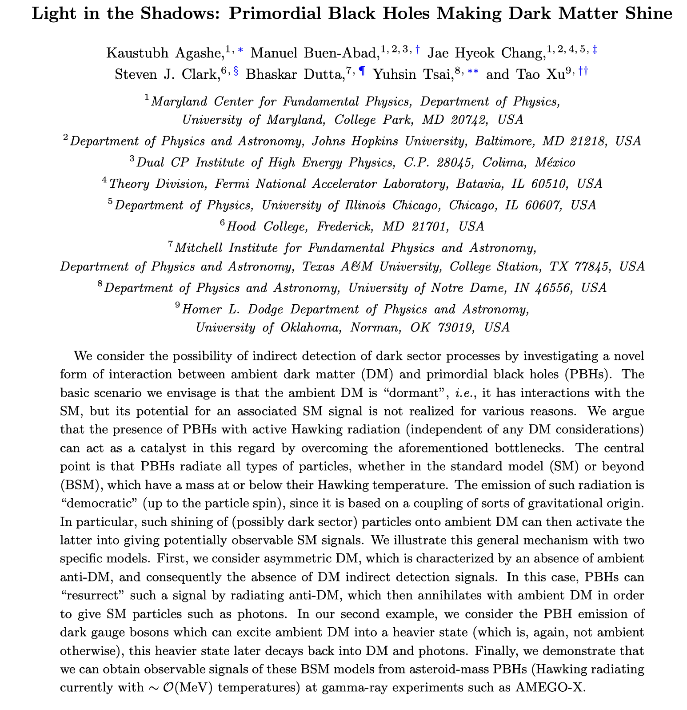

今天开始进行一个新的计划。准备不定时发一些看到的好文章（也可能包括自己的），但发布不一定完全及时，比如今天发的文章就不是最近1-2周内挂到arxiv的。

发送平台为知乎、公众号，X（英文）、和个人主页（双语）。

今天介绍文章是马里兰大学的组在2022和2024两年先后发布的两篇文章。

[Detecting Axion-Like Particles with Primordial Black Holes](http://arxiv.org/abs/2212.11980)

[Light in the Shadows: Primordial Black Holes Making Dark Matter Shine](http://arxiv.org/abs/2409.13811)

现今依然存在的原初黑洞可以帮助我们探测新物理吗？这两篇文章给了我们很好的例子。

第一篇文章的思路非常清晰：原初黑洞(primordial black hole, PBH)本身会通过霍金辐射(Hawking radiation)发射粒子，因此有希望成为一个天然的粒子制造机。只要我们有足够的探测器，就有希望探测到黑洞发出的粒子物理信号。

文章用axion-like particle (ALP)作为典型例子。这里选取的是主要衰变为光子对的ALP。如果ALP会被黑洞产生，并在抵达地球之前衰变为一对光子，就有希望被诸如e-ASTROGRAM、AMEGO之类的实验捕捉到，从而帮助我们寻找ALP。

标准模型可以产生类似的信号吗？也可以。黑洞可以直接发射光子。但如果ALP存在，会改变发射的光子谱。如下图。

可以看到ALP的存在会让接收到的光子谱改变形状，由此可以探测是否真的存在ALP。

根据形状的改变，加以统计学分析之后，就可以预测出黑洞源能够探测的参数空间。如下图。

阴影区域是预测：若存在对应质量的黑洞（例如红色对应的是质量为 $10^{15}$g 的黑洞），则预计此区域的ALP可以被捕捉。在已知存在此质量的黑洞的前提下，若ALP实际未被捕捉到，说明此参数空间被排除。

图也可以反过来画：如果我们要探测某个参数的ALP，又需要多大质量的黑洞？下图就给出了答案：例如途中的蓝色线表示只有黑洞的参数在蓝色线上方时才能产生足够多的1 MeV的ALP从而被观测到。

利用类似的思路，作进一步思考，会发现黑洞还可以做如下的事情：

很多时候暗物质湮灭在现今世界是很难的，因此indirect detection的信号非常难以捕捉。例如，如果暗物质的asymmetric dark matter，那么暗物质的反粒子密度极低，暗物质难以找到反物质进行湮灭，因此目前indirect detection就找不到暗物质湮灭的信号。

黑洞补齐了这一点：缺啥补啥。暗物质缺反物质或者其他的湮灭对象？来我给你发出来。

这就是第二篇文章要做的事情。

文章举了两个模型作为例子。这里我只提第一个，boosted anti-dark matter (BaDM)。会产生如下的结果图，理解方式和上图相同。

几个关键问题：

黑洞能探测的质量范围由什么决定？黑洞的温度，而温度由黑洞的质量决定，黑洞质量越低，温度越高，越容易发射粒子。因此上面两图中能够探测到粒子的黑洞在斜线“左”上方。

太轻的黑洞因为发射太快，早就把自己发射没了，活不到现在。所以黑洞的质量有下限。

黑洞探测相比加速器实验有什么好处？黑洞发射粒子是引力效应，哪怕粒子的相互作用非常弱，依然有希望通过引力效应从黑洞中大量产生。而加速器就很难造出相互作用很弱的粒子。

以及，第二篇文章的introduction写的尤其好。