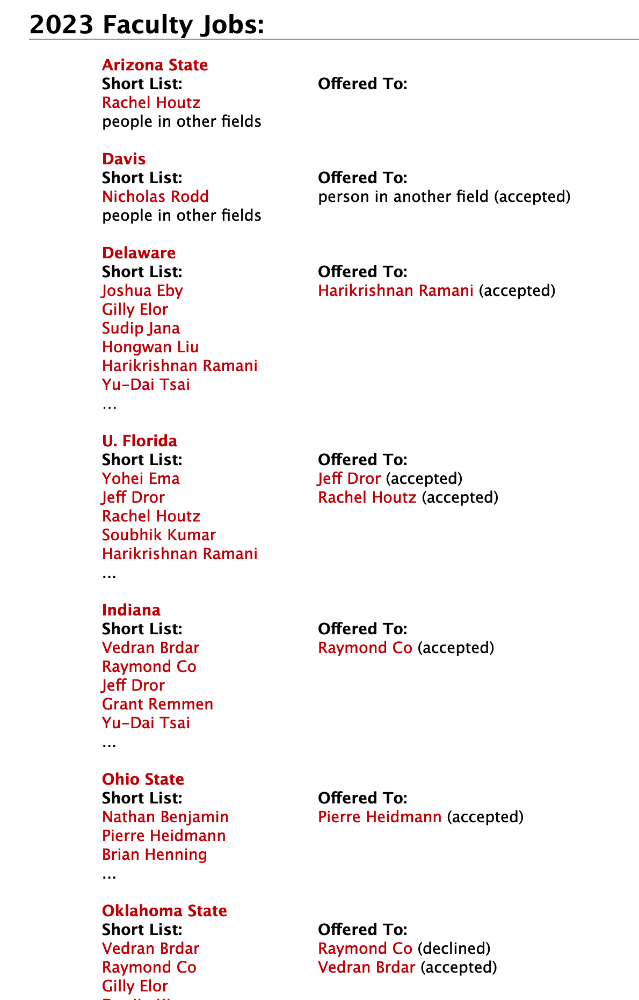

本文首发于知乎：[找理论物理方面教职的难度如何？ - QuarkQuartet的回答 - 知乎](https://www.zhihu.com/question/348742808/answer/3028090106)。也欢迎关注本人的知乎账号。

下面这个网站有1994年起所有北美的高能理论（包括th和ph）的教职招聘记录。



包括了所有最终获得职位的人，也包括了进入shortlist的人。

这里出现的所有名字，点开都可以链接到他们的hep inspire profile。里面有详细的简历和发表引用数据、记录。

没有什么比这个更好的参考了。自己去翻，自己体会。每个人的体会不一样，听别人讲感受而非data point本质上是小马过河。

如果不是高能理论而是其他的理论物理方向，那么上述搜索途径不适用。

如果是回国教职，难度会降低。这个网站的Asian板块数据貌似不全，建议手动去国内各大高校物理系的网站找近年教职招聘情况。